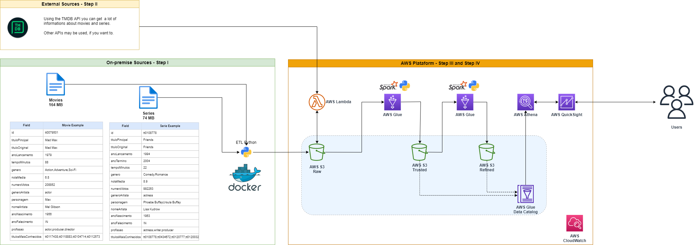
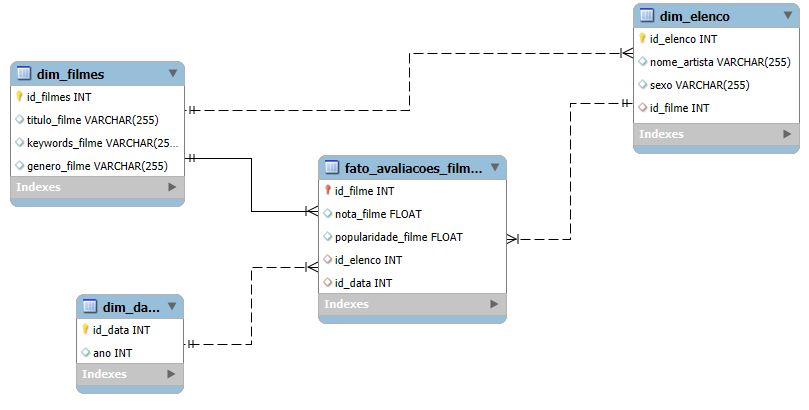
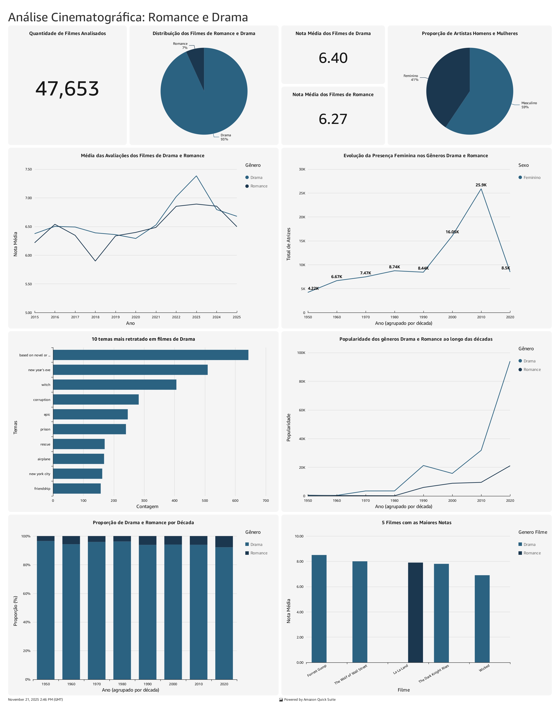

# Data Lake AWS – Análise de Filmes (Drama e Romance)

Projeto de engenharia de dados desenvolvido durante estágio na [AI/R Compass UOL](https://aircompany.ai/), com construção de um pipeline completo em AWS utilizando arquitetura Data Lake/Lakehouse.

O objetivo foi processar, modelar e analisar dados de filmes (CSV + API TMDb), totalizando mais de 47 mil registros, com foco nos gêneros Drama e Romance.

## Projeto desenvolvido em ambiente de estágio

Este projeto foi desenvolvido como entrega final do estágio na Compass UOL, integrando uma trilha prática de engenharia de dados na AWS.

🔗 Repositório completo do estágio: [https://github.com/gabitrombetta/scholarship-compass](https://github.com/gabitrombetta/scholarship-compass)

## Arquitetura

O pipeline segue as camadas:

- Ingestão (CSV e API via S3 e Lambda)
- Camada Raw (S3)
- Camada Trusted (AWS Glue + Spark)
- Camada Refined (modelagem dimensional)
- Camada Analytics (QuickSight)



## Tecnologias

- AWS S3
- AWS Glue
- AWS Lambda
- Apache Spark (PySpark)
- AWS Athena
- Amazon QuickSight
- Python (boto3)
- Docker

## Modelagem Dimensional

Foi utilizado um modelo dimensional do tipo Star Schema para suportar análises analíticas.



## Análise

- Distribuição de gêneros
- Evolução de avaliações e popularidade
- Tendências por década
- Análise de elenco (gênero e presença feminina)
- Top 5 filmes mais bem avaliados

## Dashboard

Visualização desenvolvida no Amazon QuickSight com base na camada Refined.



## Estrutura

```
analytics/        # dashboards e análises
architecture/     # diagramas do sistema
docs/             # documentação do projeto
ingestion/        # scripts de ingestão
processing/       # jobs de transformação
```

## Autor

Gabriela Trombetta

[LinkedIn](https://www.linkedin.com/in/gabitrombetta/) • [GitHub](https://github.com/gabitrombetta)